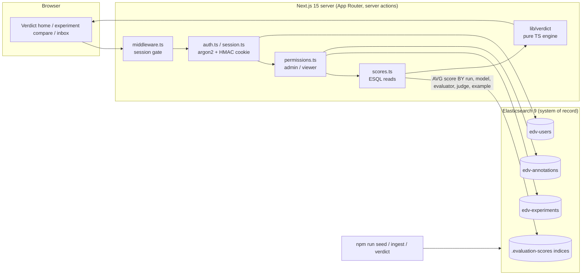
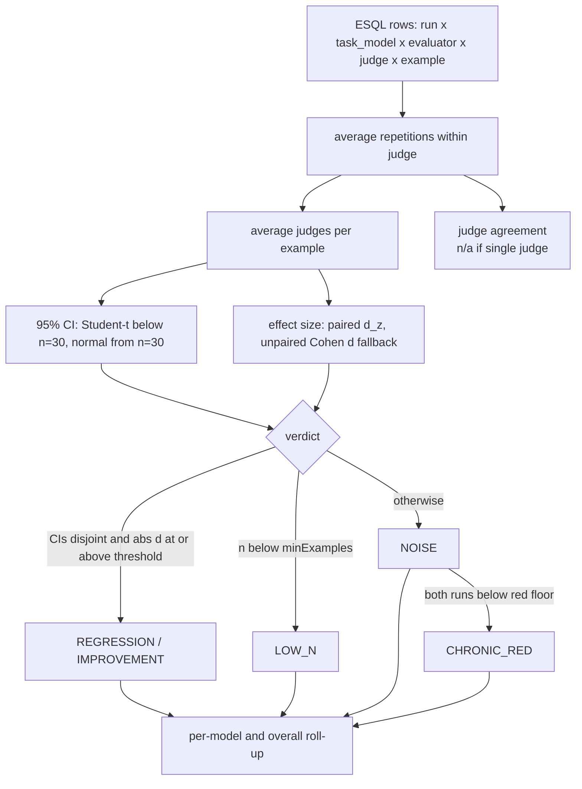
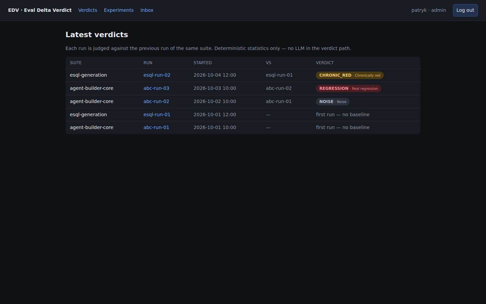
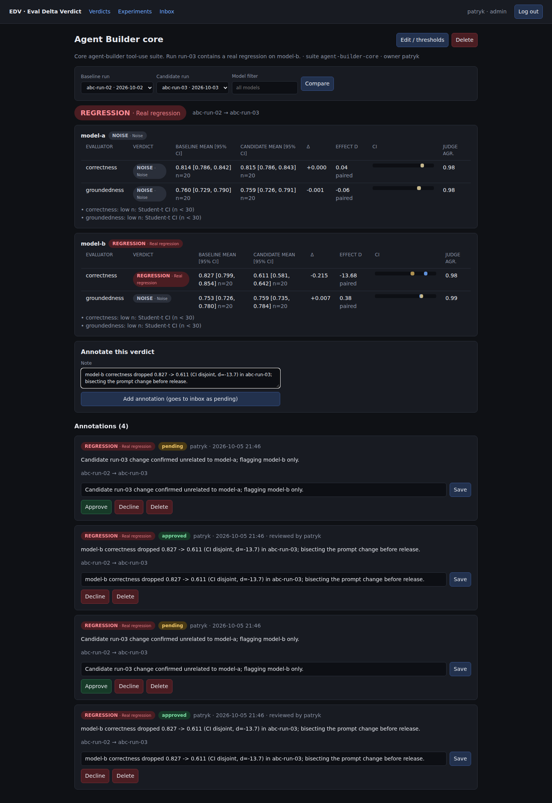
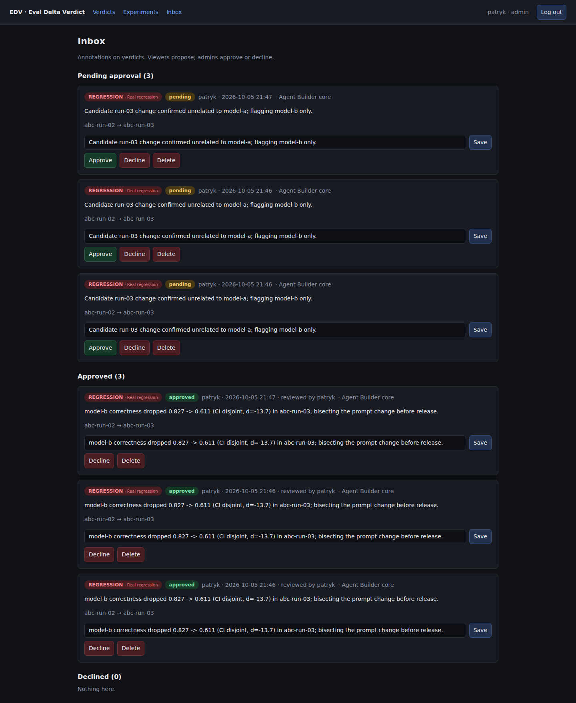
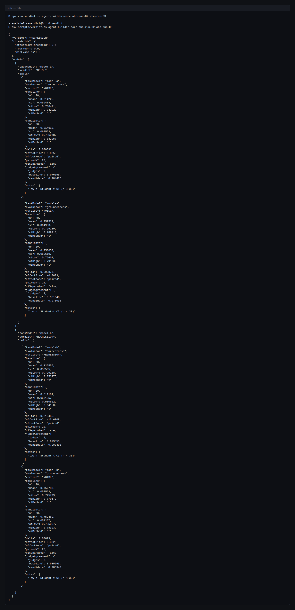

# EDV — Eval Delta Verdict

Point at an eval suite and two runs; get a verdict — **real regression** vs **noise / chronically red** —
with confidence intervals, per model, backed by Elasticsearch. Deterministic statistics only; no LLM in the verdict path. An optional, flag-gated judge seam exists (`src/lib/judge.ts`, decision D4) but is OFF by default and never in the verdict path.

Data shape is the kbn-evals `.evaluation-scores*` golden shape. Course project (10xDevs 4.0 10xBuilder).

## Run locally
```bash
cp .env.example .env.local   # optional; defaults work
npm install
npm run es:up                # ES 9 on 127.0.0.1:19200, security off (local only)
npm run seed                 # users, experiments, deterministic runs
npm run build && npm start   # http://localhost:3000
```
Seeded logins (dev defaults, local only): `patryk` / `patryk-edv-2026` (admin), `demo` / `demo-edv-2026` (viewer). Override with `EDV_SEED_ADMIN_PASSWORD` / `EDV_SEED_VIEWER_PASSWORD` and set `SESSION_SECRET` for any non-local deployment.

## Live demo

A seeded instance runs at **https://edv.widzimysie.pl** behind a Cloudflare tunnel. The dev-default logins above do **not** work there — credentials are rotated per deployment; ask the maintainer for a viewer account. Both the app (`127.0.0.1:3000`) and its dedicated Elasticsearch (`127.0.0.1:19200`) bind to loopback only; the tunnel is the sole public entry point.

Load real kbn-evals exports: `npm run ingest -- --index .evaluation-scores-2026.10 < scores.ndjson`
CLI verdict: `npm run verdict -- agent-builder-core abc-run-02 abc-run-03`

## Test
```bash
npm run lint && npm run typecheck && npm test   # unit (verdict engine, auth, guards)
npm run e2e                                      # Playwright against real ES; needs `npm run build` + es:up
```
CI (`.github/workflows/ci.yml`) runs all of the above with an ephemeral ES 9 service.

## Architecture



Verdict engine flow (`src/lib/verdict`, deterministic: no I/O, clock, randomness or LLM):



More detail: `docs/architecture.md`.

## Screenshots

Captured headless (Chromium, 1440x900, dark UI) against the seeded stack by `node scripts/screenshots.mjs`.

1. Land-on-verdict home with per-run badges

   

2. Experiment compare: `abc-run-02 -> abc-run-03` is a REGRESSION on model-b correctness (disjoint 95% CIs, paired effect size)

   

3. Annotation / approval inbox (pending and approved)

   

4. CLI: `npm run verdict -- agent-builder-core abc-run-02 abc-run-03` (raw text: `docs/screenshots/04-cli-output.txt`)

   

## Data model

Scores are the kbn-evals `.evaluation-scores*` golden shape, ingested as-is (mapping in `src/lib/es.ts`). One doc = one evaluator score for one example in one repetition of one run.

| Field | ES type | Meaning |
|---|---|---|
| `@timestamp` | date | optional; used to order runs |
| `experiment_name` | keyword | suite name (e.g. `agent-builder-core`) |
| `experiment_id` | keyword | run id (e.g. `abc-run-03`) |
| `example.id` | keyword | dataset example; the pairing key between two runs |
| `task.repetition_index` | integer | repetition of the example within the run |
| `evaluator.name` | keyword | evaluator (e.g. `correctness`) |
| `evaluator.score` | double | score in [0, 1] |
| `evaluator_model.id` | keyword | judge model that produced the score |
| `task_model.id` | keyword | model under test |

EDV-owned indices: `edv-users` (username, role, password_hash, created_at), `edv-experiments` (name, description, owner, thresholds.{effectSizeThreshold, redFloor, minExamples}, timestamps), `edv-annotations` (experiment_id, baseline_run, candidate_run, verdict, text, status pending|approved|declined, author, reviewed_by, timestamps).

Judge-agreement alignment (with `@kbn/evals` judge_agreement): repetitions are averaged within a judge (`evaluator_model.id`) first; agreement is then computed across judges on those per-judge example scores as `1 - mean over examples of mean pairwise |diff|`. Cells scored by a single judge are excluded from agreement stats (shown as n/a) but their scores still feed the verdict. See `judgeAgreement` in `src/lib/verdict/engine.ts`.

## Course criteria mapping

The repo does not store the course rubric text (see `docs/course/README.md`). The six criteria below are the working interpretation used by the code comments and tests (criterion 1 = role model, criterion 5 = user-perspective test); check them against the platform rubric.

| # | Criterion | Where implemented |
|---|---|---|
| 1 | Authentication and role-based access | `src/lib/auth.ts`, `src/lib/session.ts`, `src/lib/permissions.ts`, `src/middleware.ts`, `src/app/login/`; tests `tests/unit/auth.test.ts` |
| 2 | CRUD on a domain entity with approval flow | `src/lib/stores.ts`, `src/app/actions.ts`, `src/app/experiments/`, `src/app/inbox/`, `src/components/AnnotationItem.tsx`, `src/components/ExperimentForm.tsx` |
| 3 | Core business logic (verdict engine) | `src/lib/verdict/{engine,stats,types}.ts`, `src/lib/scores.ts`, `src/lib/home.ts`; tests `tests/unit/verdict.test.ts`, `tests/unit/guards.test.ts` |
| 4 | Real data store (Elasticsearch) with seed/ingest | `src/lib/es.ts`, `src/lib/seed-data.ts`, `src/lib/ingest.ts`, `scripts/seed.ts`, `scripts/ingest.ts`, `docker-compose.yml` |
| 5 | User-perspective end-to-end test | `tests/e2e/user-journey.spec.ts`, `tests/e2e/global-setup.ts`, `playwright.config.ts` |
| 6 | CI/CD and documentation | `.github/workflows/ci.yml`, `README.md`, `docs/architecture.md`, `docs/roadmap.md`, `docs/screenshots/` |


See `docs/architecture.md`, `docs/roadmap.md`, `docs/course/README.md`.
